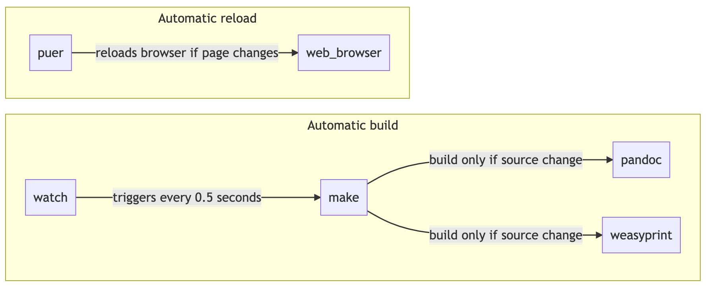

# 📄 Resume 

📄 Resume for the tech-savvies:
- edit it in **markdown**
- share it as **html**
- send it as **pdf**

Inspired by [chmduquesne/resume](https://github.com/chmduquesne/resume)

## Content

- resume as html here 👉 [qchenevier.github.io/resume/](https://qchenevier.github.io/resume/)
- resume as pdf here 👉 [resume.pdf](https://raw.githubusercontent.com/qchenevier/resume/master/resume.pdf)

## How to use

[comment]: # (```mermaid)
[comment]: # (graph LR;)
[comment]: # ()
[comment]: # (  subgraph "Automatic build")
[comment]: # (  watch-- triggers every 0.5 seconds-->make;)
[comment]: # (  make-- build only if source change-->pandoc;)
[comment]: # (  make-- build only if source change-->weasyprint;)
[comment]: # (  end)
[comment]: # ()
[comment]: # (  subgraph "Automatic reload")
[comment]: # (  puer-- reloads browser if page changes-->web_browser;)
[comment]: # (  end)
[comment]: # (```)


Build management is done with `make`, which calls:
- `pandoc` to translate markdown to html
- `weasyprint` to render html to pdf

Auto-build is done with `watch`.

Auto-reload (for html) is done with `puer`.

### Installation

#### Build tools

Install `pandoc`:
```
brew install pandoc
```

Create a python environment to install `weasyprint`:
```
conda env create -f environment.yml
```

#### Auto-build
Installation of `watch` is done with `brew` (OSX only):
```
brew install watch
```

#### Auto-reload
Installation of `puer` is done with `npm`
```
npm install -g puer
```

### Launch

#### Auto-build

Activate the environment which contains `weasyprint`:
```
conda activate weasyprint
```

Use `watch` to launch the build process every 0.5 second & rebuild the html file from the markdown:
```
watch -n 0.5 make
```

#### Auto-reload
Launch puer to launch a webserver which will autoreload the html page when it has changed:
```
puer
```

Then go to http://localhost:8000/resume.html to see the result.
