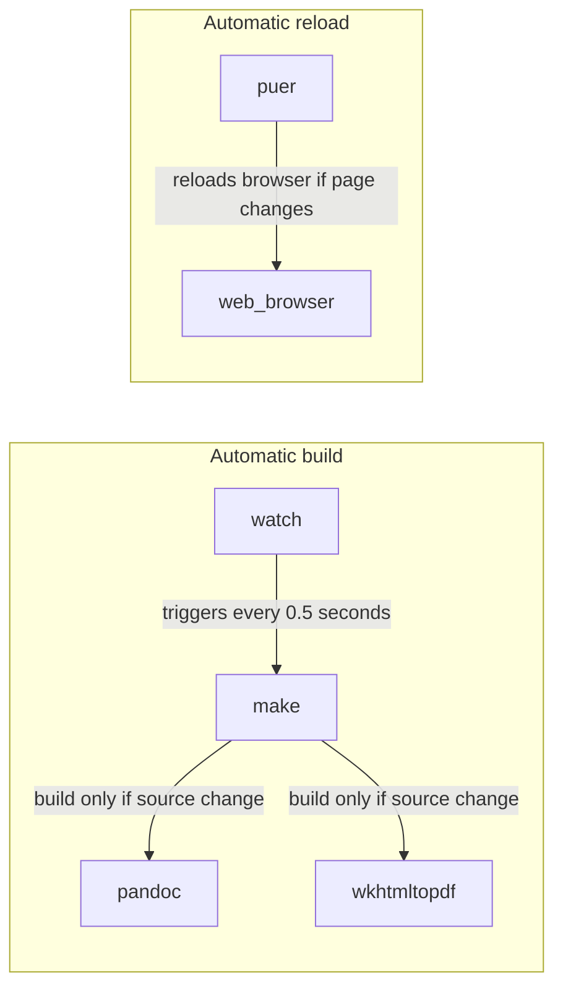

Inspired by https://github.com/chmduquesne/resume

To be used with the markdown preview enhanced plugin within atom.


## Dev stack



Build management is done with `make`, which calls:
- `pandoc` to translate markdown to html
- `wkhtmltopdf` to rendre html to pdf

Auto-build is done with `watch`.

Auto-reload (for html) is done with `puer`.

### Installation

##### Auto-build
Installation of `watch` is done with `brew` (OSX only):
```
brew install watch
```

##### Auto-reload
Installation of `puer` is done with `npm`
```
npm install -g puer
```

### Launch

##### Auto-build
Use `watch` to launch the build process every 0.5 second & rebuild the html file from the markdown
```
watch -n 0.5 make
```

##### Auto-reload
Launch puer to launch a webserver which will autoreload the html page when it has changed:
```
puer
```

Then go to http://localhost:8000/resume.html to see the result.
